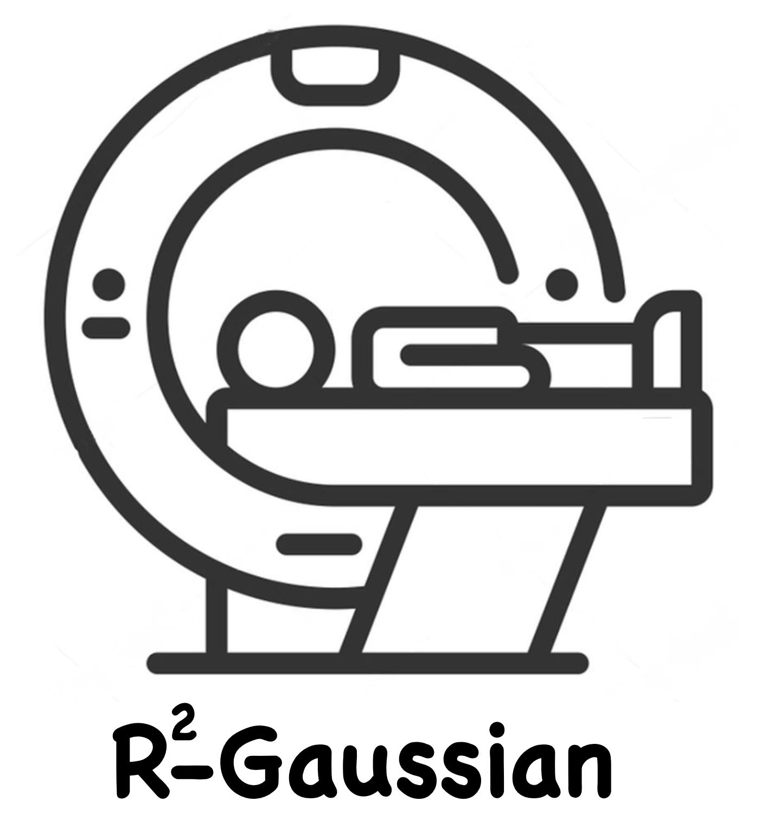
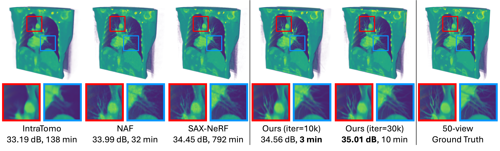
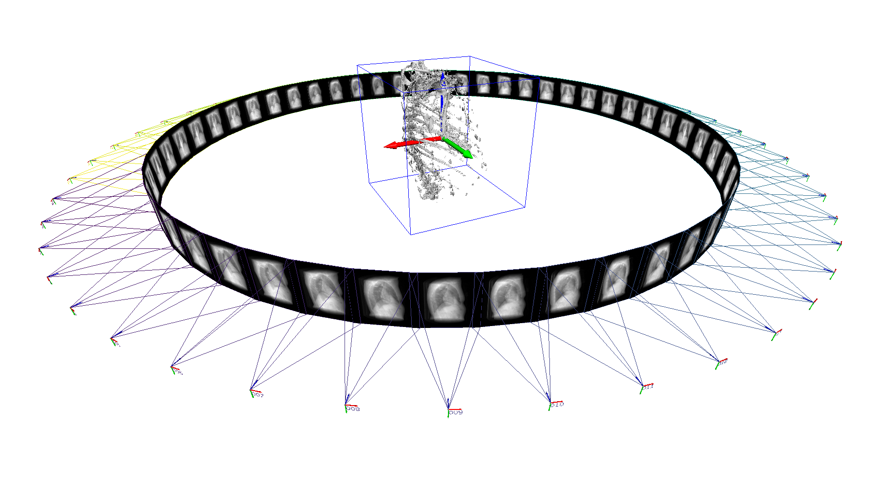

&nbsp;

<div align="center">

<p align="center">  </p>

[Arxiv](https://arxiv.org/abs/2405.20693) | [Data](https://drive.google.com/drive/folders/1YZ3w87XrCNyjDRos6gkY8zgT5hESl-PN?usp=sharing) | [Models](https://drive.google.com/drive/folders/1HIvO7aS2gbp7Qx3ceHiRSNoAKKS_VnjU?usp=sharing) | [Project](https://ruyi-zha.github.io/r2_gaussian/r2_gaussian.html)

<h2> Rectifying Radiative Gaussian Splatting for Tomographic Reconstruction </h2> 

*Fast and direct CT reconstruction with 3D Gaussian Splatting.*





</div>


&nbsp;


### Introduction

This is the official repo of our NeurIPS 2024 paper [R<sup>2</sup>-Gaussian: Rectifying Radiative Gaussian Splatting for Tomographic Reconstruction](https://arxiv.org/abs/2405.20693). If you find this repo useful, please give it a star ⭐ and consider citing our paper.

### News

* 2024.10.25: Code, data, and models have been released. Welcome to have a try!
* 2024.09.27: Our work has been accepted to NeurIPS 2024.
* 2024.05.31: Our paper is available on [arxiv](https://arxiv.org/abs/2405.20693).

## 1. Installation

We recommend using [Conda](https://docs.conda.io/en/latest/miniconda.html) to set up an environment. We tested the code on Ubuntu 20.04 with an RTX 3090 GPU. For installation issues on other platforms, please refer to [Gaussian Splatting](https://github.com/graphdeco-inria/gaussian-splatting).

```sh
# Download code
git clone https://github.com/Ruyi-Zha/r2_gaussian.git --recursive

# Install environment
SET DISTUTILS_USE_SDK=1 # Windows only
conda env create --file environment.yml
conda activate r2_gaussian

# Install TIGRE for data generation and initialization
wget https://github.com/CERN/TIGRE/archive/refs/tags/v2.3.zip
unzip v2.3.zip
pip install TIGRE-2.3/Python --no-build-isolation
```

## 2. Dataset

You can download datasets (synthetic and real) used in our paper [here](https://drive.google.com/drive/folders/1YZ3w87XrCNyjDRos6gkY8zgT5hESl-PN?usp=sharing). We follow NeRF format (folders with `meta_data.json`). You can find more details of data format and generation process in [synthetic dataset](data_generator/synthetic_dataset/README.md) and [real dataset](data_generator/real_dataset/README.md). Organize data as follows.

```sh
└── data
│   ├── synthetic_dataset
│   │   ├── cone_ntrain_50_angle_360
│   │   │   ├── 0_chest_cone  # Case name
│   │   │   │   ├── proj_test  # Projections for 2D rendering evaluation
│   │   │   │   │   └── *.npy
│   │   │   │   ├── proj_train  # Projections for training
│   │   │   │   │   └── *.npy
│   │   │   │   ├── init_*.npy  # initialization point cloud file
│   │   │   │   ├── meta_data.json  # Scanner configuration, projection parameters, etc.
│   │   │   │   ├── vol_gt.npy  # Ground truth volume
│   │   │   └──...
│   │   └──...
│   └── real dataset
│   │   ├── cone_ntrain_50_angle_360
│   │   │   ├── pine  # Case name
│   │   │   └──...
│   │   └──...
```

You can visually check the scene with `python scripts/visualize_scene.py -s <path to data>`. Thanks @MrMonk3y for providing code.


We also support [NAF](https://github.com/Ruyi-Zha/naf_cbct) format data (`*.pickle`) used in [SAX-NeRF](https://github.com/caiyuanhao1998/SAX-NeRF).

We have converted our datasets to NAF format for your convenience. You can find them in [here](https://drive.google.com/drive/folders/1YZ3w87XrCNyjDRos6gkY8zgT5hESl-PN?usp=sharing).

## 3. Running

### 3.1 Initialization (optional)

We have included initialization files in our dataset. You can skip this step if using our dataset.

For new data, you need to use `initialize_pcd.py` to generate a `*.npy` file which stores the point cloud for Gaussian initialization.

```sh
python initialize_pcd.py --data <path to data>
```

<details>
<summary><span style="font-weight: bold;">Command line arguments for initialize_pcd.py</span></summary>

##### --data

Path to the source directory containing `meta_data.json` or `*.pickle`.

##### --output

Path to the output `*.npy` file. `<path to data>/<data name>_init.npy` by default.

##### --evaluate

Add this flag to evaluate the 3D PSNR of initial Gaussians. It is used for debugging purpose since it uses the ground truth volume.

##### --recon_method

Method used for reconstructing initial volume. Now we support `fdk` (sample from FDK volume) or `random` (sample randomly). `fdk` by default.

##### --n_points

Number of points for initialization. `50000` by default.

##### --density_thresh

We sample voxels with density higher than the threshold. `0.05` by default.

##### --density_rescale

We empirically rescale the queried density value to account for occlusion. `0.15` by default.

##### --random_density_max

Maximum density for random initialization. `1.0` by default.

</details>
<br>

:exclamation: Initialization is important for most 3DGS-based methods, including ours. We initialize the point clouds by sampling from a noisy volume reconstructed using the FDK algorithm.

Our default settings assume the density ranges from `[0, 1]`. You may need to adjust the parameters in `initialize_pcd.py` according to your dataset to achieve better results. To assess the quality of the initialization, add `--evaluation` flag.

### 3.2 Training

Use `train.py` to train Gaussians. Make sure that the initialization file `*.npy` has been generated.

```sh
# Training
python train.py -s <path to data>

# Example
python train.py -s XXX/0_chest_cone  # NeRF format
python train.py -s XXX/*.pickle  # NAF format
```

<details>
<summary><span style="font-weight: bold;">Command line arguments for train.py</span></summary>

#### Dataset and Model

##### --source_path / -s

Path to the source directory containing `meta_data.json` or `*.pickle`.

##### --model_path / -m

Path where the trained model should be stored (```output/<random>``` by default).

##### --ply_path

Path to initialization point cloud `*.npy`. `<path to data>/init_<data name>.npy` by default.

##### --scale_min

Minimum scale of a Gaussian (expressed as a percentage of the volume size). `0.0005` by default.

##### --scale_max

Maximum scale of a Gaussian (expressed as a percentage of the volume size). `0.5` by default.

##### --eval

Add this flag to evaluate 2D rendering during training.

#### Optimizer

##### --iterations

Number of total iterations to train for, `30_000` by default.

##### --position_lr_init

Initial position learning rate, `0.0002` by default.
  
##### -position_lr_final

Initial position learning rate, `0.00002` by default.
  
##### --position_lr_max_steps

Number of steps (from 0) where position learning rate goes from `initial` to `final`. `30_000` by default.
  
##### --density_lr_init

Initial density learning rate, `0.01` by default.
  
##### --density_lr_final
  
Initial density learning rate, `0.001` by default.
  
##### --density_lr_max_steps
  
Number of steps (from 0) where density learning rate goes from `initial` to `final`. `30_000` by default.
  
##### --scaling_lr_init
  
Initial scaling learning rate, `0.005` by default.
  
##### --scaling_lr_final
  
Initial scaling learning rate, `0.0005` by default.
  
##### --scaling_lr_max_steps
  
Number of steps (from 0) where scaling learning rate goes from `initial` to `final`. `30_000` by default.
  
##### --rotation_lr_init
  
Initial rotation learning rate, `0.001` by default.
  
##### --rotation_lr_final
  
Initial rotation learning rate, `0.0001` by default.
  
##### --rotation_lr_max_steps
  
Number of steps (from 0) where rotation learning rate goes from `initial` to `final`. `30_000` by default.
  
##### --lambda_dssim

Weight of SSIM loss. `0.25` by default.
  
##### --lambda_tv
  
Weight of total variation loss. `0.05` by default.
  
##### --tv_vol_size
  
Size of tiny volume used for computing total variation. `32` by default.
  
##### --density_min_threshold
  
For adaptive control. Prune Gaussians with density less than this threshold. `0.00001` by default.
  
##### --densification_interval
  
How frequently to densify, `100` (every 100 iterations) by default.
  
##### --densify_from_iter
  
Iteration where densification starts, `500` by default.
  
##### --densify_until_iter
  
Iteration where densification stops, `15_000` by default.
  
##### --densify_grad_threshold
  
Limit that decides if points should be densified based on position gradient, `0.00005` by default.
  
##### --densify_scale_threshold
  
Densify Gaussians with 3D size larger than this threshold (expressed as a percentage of the volume size). `0.1` by default.
  
##### --max_screen_size
  
Prune Gaussians with 2D screen size larger than this threshold. `None` by default.
  
##### --max_scale
  
Prune Gaussians with 3D size larger than this threshold. `None` by default.
  
##### --max_num_gaussians
  
Stop denstification if Gaussians are more than this threshold. `500_000` by default.

#### Others
  
##### --test_iterations
  
Space-separated iterations at which the training script evaluate rendering and reconstruction performance over test set.
  
##### --save_iterations
  
Space-separated iterations at which the training script saves the Gaussian model.
  
##### --checkpoint_iterations
  
Space-separated iterations at which to store a checkpoint for continuing later, saved in the model directory.
  
##### --start_checkpoint
  
Path to a saved checkpoint to continue training from.
  
##### --quiet
  
Flag to omit any text written to standard out pipe.
  
##### --config
  
Path to `*.yml` file. If specified, overwrite other parameters.

</details>
<br>

:exclamation: If the training speed is slow or too many Gaussians are generated, you can adjust `--densify_grad_threshold` by increasing its value or disable density control entirely by setting `--densify_until_iter` to `0`. In most cases, disabling density control does not greatly impact the reconstruction quality if a sufficient number of Gaussians are initialized.

:exclamation:  We scale the entire scene (scanner, projections, target volume) into a `[-1,1]^3` space for numerical stability.

For our synthetic dataset (`512x512` projections, `256x256x256` volume), the complete training process typically takes `5–15` minutes on an RTX 3090 GPU, with plausible results achievable in `3` minutes. The training time and model size depend on the object's structure. Sparser objects (e.g., a teapot) generally lead to faster training.

You can also use `scripts/train_all.py` to train all cases in a folder.

```sh
# Example
python scripts/train_all.py \
  --source data/synthetic_dataset/cone_ntrain_50_angle_360 \
  --output output/synthetic_dataset/cone_ntrain_50_angle_360 \
  --device 0
```

### 3.3 Evaluation

We store evaluation results into the tensorboard events during training. You can also perform more detailed evaluation with `test.py`.

```sh
python test.py -m <path to trained model>
```

<details>
<summary><span style="font-weight: bold;">Command line arguments for test.py</span></summary>

##### --model_path / -m
  
Path where the trained model should be stored. ```output/<random>``` by default.
  
##### --source_path / -s
  
Path to the source directory containing `meta_data.json` or `*.pickle`. If not set, it will be automatically loaded from the model path.
  
##### --iterations
  
Iterations for evaluation. `-1` (latest iteration) by default.
  
##### --skip_render_train
  
Flag to skip rendering the training set.
  
##### --skip_render_test
  
Flag to skip rendering the testing set.
  
##### --skip_recon
  
Flag to skip reconstructing the volume.

</details>
<br>

You can find all trained models [here](https://drive.google.com/drive/folders/1HIvO7aS2gbp7Qx3ceHiRSNoAKKS_VnjU?usp=sharing). We report quantitative results on all datasets (synthetic, real, and SAX-NeRF datasets) [here](assets/results.md).

## 4. Generate your own data

:exclamation: Our code supports both cone beam and parallel beam configurations.

If you have ground truth volumes but do not have X-ray projections, follow this [instruction](data_generator/synthetic_dataset/README.md) to generate your own dataset.

If you have (more than 100) X-ray projections but do not have ground volumes, follow this [instruction](data_generator/real_dataset/README.md).

If you want to test your own data, please first convert it to our format (`meta_data.json`) or SAX-NeRF (`*.pickle`) and generate initialization point clouds with `initialize_pcd.py`.

## 5. Acknowledgement, license and citation

Our code is adapted from [Gaussian Splatting](https://github.com/graphdeco-inria/gaussian-splatting), [SAX-NeRF](https://github.com/caiyuanhao1998/SAX-NeRF), [NAF](https://github.com/Ruyi-Zha/naf_cbct) and [TIGRE toolbox](https://github.com/CERN/TIGRE.git). We thank the authors for their excellent works.

This project is under the license of [Gaussian Splatting](https://github.com/graphdeco-inria/gaussian-splatting).

If this repo helps you, please consider citing our work:

```
@inproceedings{r2_gaussian,
  title={R$^2$-Gaussian: Rectifying Radiative Gaussian Splatting for Tomographic Reconstruction},
  author={Ruyi Zha and Tao Jun Lin and Yuanhao Cai and Jiwen Cao and Yanhao Zhang and Hongdong Li},
  booktitle = {Advances in Neural Information Processing Systems (NeurIPS)},
  year={2024}
}
```
