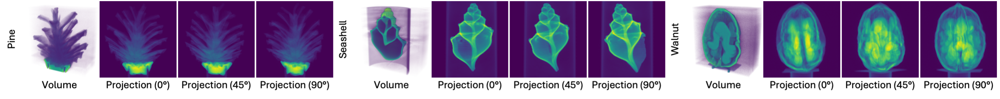

# Real dataset



Here we describe the data processing steps for real dataset (real X-ray projection, pseudo-GT volume).

## Download raw data

We use three cases from [FIPS](https://fips.fi/category/open-datasets/x-ray-tomographic-datasets/) public dataset .Download raw data and put them into `data_generator/real_dataset/FIPS_raw`. Arrange data structure as follow.

```sh
└── data_generator   
│   └── real_dataset
│   │   └── FIPS_raw
│   │   │   ├── pine
│   │   │   │   ├── 20201111_walnut_.txt
│   │   │   │   ├── 20201111_walnut_0001.tif
│   │   │   │   ├── ...
│   │   │   │   └── 20201111_walnut_0721.tif
│   │   │   ├── seashell
│   │   │   │   ├── 20211124_seashell_.txt
│   │   │   │   ├── 20211124_seashell_0001.tif
│   │   │   │   ├── ...
│   │   │   │   └── 20211124_seashell_0721.tif
│   │   │   └── walnut
│   │   │   │   ├── 20201111_walnut_.txt
│   │   │   │   ├── 20201111_walnut_0001.tif
│   │   │   │   ├── ...
│   │   │   │   └── 20201111_walnut_0721.tif
```

| Case name | Dataset source                                               | Note                                                         |
| --------- | ------------------------------------------------------------ | ------------------------------------------------------------ |
| Pine     | [FIPS](https://fips.fi/open-datasets/x-ray-tomographic-datasets/3d-cone-beam-computed-tomography-dataset-of-a-pine-cone/) | Download all `*_.zip` files and `*.text` configuration file.                                   |
| Seashell     | [FIPS](https://fips.fi/open-datasets/x-ray-tomographic-datasets/3d-cone-beam-computed-tomography-dataset-of-a-seashell/) | Download all `*_.zip` files and `*.text` configuration file.                                      |
| Walnut     | [FIPS](https://fips.fi/open-datasets/x-ray-tomographic-datasets/3d-cone-beam-computed-tomography-dataset-of-a-walnut/) | Download all `*_.zip` files and `*.text` configuration file.  |
## Extract X-ray projections from raw data

Use [HelTomo Matlab Toolbox](https://github.com/Diagonalizable/HelTomo) to extract X-ray projections from raw data. You can install HelTomo Toolbox via Matlab Add-on Explorer or locally.

After installing HelTomo, run `fips_process_raw_data.m` with Matlab. The extracted projections will be saved in `data_generator/real_dataset/FIPS_processed`.

```sh
└── data_generator   
│   └── real_dataset
│   │   └── FIPS_processed
│   │   │   ├── pine
│   │   │   │   ├── 0001.mat
│   │   │   │   ├── ...
│   │   │   │   └── 0721.mat
│   │   │   ├── seashell
│   │   │   │   ├── 0001.mat
│   │   │   │   ├── ...
│   │   │   │   └── 0721.mat
│   │   │   └── walnut
│   │   │   │   ├── 0001.mat
│   │   │   │   ├── ...
│   │   │   │   └── 0721.mat
```

## Process data and generate pseudo-GT volume.

We preprocess X-ray projections by resizing them to `560x560` and rescale values to around `[0, 1]`. We also rescale the scene size to fit it into a unit cube. We use FDK to generate pseudo-GT volume from all `721` projections. We then sample `N` projections uniformly as training set and another `100` projections randomly as test set (for 2D rendering performance).

```sh
# 75-view
python data_generator/real_dataset/generate_data_all.py \
  --data data_generator/real_dataset/FIPS_processed \
  --out data/real_dataset \
  --n_train 75 

# 50-view
python data_generator/real_dataset/generate_data_all.py \
  --data data_generator/real_dataset/FIPS_processed \
  --out data/real_dataset \
  --n_train 50 

# 25-view
python data_generator/real_dataset/generate_data_all.py \
  --data data_generator/real_dataset/FIPS_processed \
  --out data/real_dataset \
  --n_train 25 
```
You can visually check the processed volume data with `data_generator/check_volume.py`, and projection data with `data_generator/check_proj.py`.


## Initialize Gaussians

Use `data_generator/initialize_pcd_all.py` to generate initialized Gaussian point clouds of all cases. You can also initialize one case with `initialize_pcd.py`. The generated point cloud will be saved to `init/*.npy` in each data folder.

```sh
# 75-view
python data_generator/initialize_pcd_all.py \
  --data data/real_dataset/cone_ntrain_75_angle_360 \
  --device 0
# 50-view
python data_generator/initialize_pcd_all.py \
  --data data/real_dataset/cone_ntrain_50_angle_360 \
  --device 0
# 25-view
python data_generator/initialize_pcd_all.py \
  --data data/real_dataset/cone_ntrain_25_angle_360 \
  --device 0

# (Optional) Single case example
python initialize_pcd.py --data XXX --output XXX --INIT_ARGS
```
Finally, data format should be as follows.
```sh
├── data
│   ├── real_dataset
│   │   ├── cone_ntrain_75_angle_360
│   │   │   ├── pine
│   │   │   │   ├── proj_train
│   │   │   │   │   ├──  *.npy
│   │   │   │   │   └──  ...
│   │   │   │   ├── proj_test
│   │   │   │   │   ├──  *.npy
│   │   │   │   │   └──  ...
│   │   │   │   ├── init_*.npy
│   │   │   │   ├── meta_data.json
│   │   │   │   └── vol_gt.npy
│   │   │   └── ...
│   │   ├── cone_ntrain_50_angle_360
│   │   └── cone_ntrain_25_angle_360
```

## Reference
We acknowledges authors for providing open source datasets. Please cite them if you use related data.

```
@misc{FIPS_CT_dataset,
  author       = {The Finnish Inverse Problems Society},
  title        = {X-ray Tomographic Datasets},
  year         = {2024},
  url          = {https://fips.fi/category/open-datasets/x-ray-tomographic-datasets/},
}

@misc{pine_data,
  author       = {Alexander Meaney},
  title        = {{Cone-Beam Computed Tomography Dataset of a Pine 
                   Cone}},
  month        = aug,
  year         = 2022,
  publisher    = {Zenodo},
  version      = {1.1.0},
  doi          = {10.5281/zenodo.6985407},
  url          = {https://doi.org/10.5281/zenodo.6985407}
}

@misc{walnut_data,
  author       = {Alexander Meaney},
  title        = {Cone-Beam Computed Tomography Dataset of a Walnut},
  month        = aug,
  year         = 2022,
  publisher    = {Zenodo},
  version      = {1.1.0},
  doi          = {10.5281/zenodo.6986012},
  url          = {https://doi.org/10.5281/zenodo.6986012}
}

@misc{seashell_data,
  author       = {Kamutta, Emma and
                  Mäkinen, Sofia and
                  Meaney, Alexander},
  title        = {{Cone-Beam Computed Tomography Dataset of a 
                   Seashell}},
  month        = aug,
  year         = 2022,
  publisher    = {Zenodo},
  version      = {1.1.0},
  doi          = {10.5281/zenodo.6983008},
  url          = {https://doi.org/10.5281/zenodo.6983008}
}
```