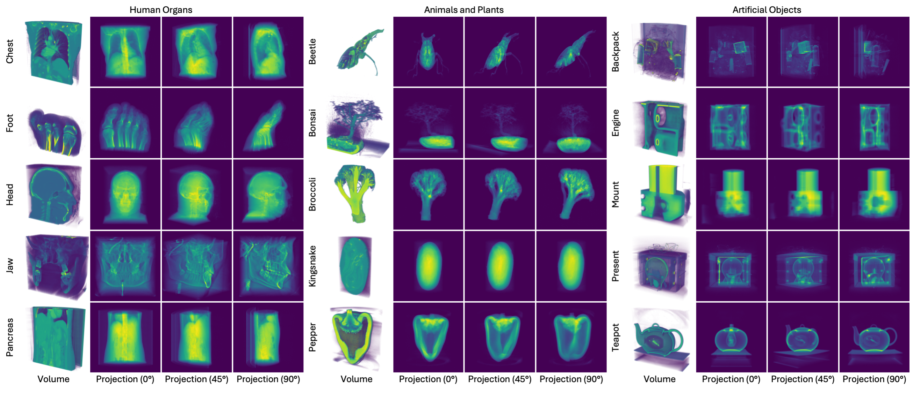

# Synthetic dataset



Here we describe the data processing steps for synthetic dataset (real volume, synthetic X-ray projections). You can also generate your own data similarly.

## Download raw data

We use data from open source CT datasets [SciVis](https://klacansky.com/open-scivis-datasets/), [LIDC-IDRI](https://www.cancerimagingarchive.net/collection/lidc-idri/), [Pancreas-CT](https://wiki.cancerimagingarchive.net/display/Public/Pancreas-CT), and [X-Plant](https://www.biw.kuleuven.be/biosyst/mebios/downloads/3d-x-ray-images-of-plant-organs/3d-x-ray-images-of-plant-organs). The raw data link are shown as follows. Download raw data and put them into `data_generator/synthetic_dataset/volume_raw`. The data structure should be as follow.

```sh
└── data_generator   
│   └── synthetic_dataset
│   │   └── volume_raw
│   │   │   ├── LIDC-IDRI-0001
│   │   │   │   └── ...
│   │   │   ├── PANCREAS_0001
│   │   │   │   └── ...
│   │   │   ├── backpack_512x512x373_uint16.raw
│   │   │   ├── bell pepper_3D_500um.tif
│   │   │   ├── bonsai_256x256x256_uint8.raw
│   │   │   ├── boston_teapot_256x256x178_uint8.raw
│   │   │   ├── Brocoli_3D_1050um.tif
│   │   │   ├── engine_256x256x128_uint8.raw
│   │   │   ├── foot_256x256x256_uint8.raw
│   │   │   ├── kingsnake_1024x1024x795_uint8.raw
│   │   │   ├── present_492x492x442_uint16.raw
│   │   │   ├── skull_256x256x256_uint8.raw
│   │   │   ├── stag_beetle_832x832x494_uint16.raw
│   │   │   ├── vis_male_128x256x256_uint8.raw
│   │   │   └── zeiss_680x680x680_uint8.raw
```

| Case type          | Case name | Dataset source                                               | Note                                                         |
| ------------------ | --------- | ------------------------------------------------------------ | ------------------------------------------------------------ |
| Human organs       | Chest     | [LIDC-IDRI](https://www.cancerimagingarchive.net/collection/lidc-idri/) | We use folder `LIDC-IDRI-0001`.                                      |
| Human organs       | Foot      | [SciVis](https://klacansky.com/open-scivis-datasets/)        | Download raw data [foot_256x256x256_uint8.raw](https://klacansky.com/open-scivis-datasets/foot/foot_256x256x256_uint8.raw). |
| Human organs       | Head      | [SciVis](https://klacansky.com/open-scivis-datasets/)        | Download raw data [vis_male_128x256x256_uint8.raw](https://klacansky.com/open-scivis-datasets/vis_male/vis_male_128x256x256_uint8.raw). |
| Human organs       | Jaw       | [SciVis](https://klacansky.com/open-scivis-datasets/)        | Download raw data [skull_256x256x256_uint8.raw](https://klacansky.com/open-scivis-datasets/skull/skull_256x256x256_uint8.raw). |
| Human organs       | Pancreas  | [Pancreas-CT](https://wiki.cancerimagingarchive.net/display/Public/Pancreas-CT) | We use folder `PANCREAS_0001`.                                |
| Animals and plants | Beetle    | [SciVis](https://klacansky.com/open-scivis-datasets/)        | Download raw data [stag_beetle_832x832x494_uint16.raw](https://klacansky.com/open-scivis-datasets/stag_beetle/stag_beetle_832x832x494_uint16.raw). |
| Animals and plants | Bonsai    | [SciVis](https://klacansky.com/open-scivis-datasets/)        | Download raw data [bonsai_256x256x256_uint8.raw](https://klacansky.com/open-scivis-datasets/bonsai/bonsai_256x256x256_uint8.raw). |
| Animals and plants | Broccoli  | [X-Plant](https://www.biw.kuleuven.be/biosyst/mebios/downloads/3d-x-ray-images-of-plant-organs/3d-x-ray-images-of-plant-organs) | Download raw data [brocoli-3d-1050um.tif](https://www.biw.kuleuven.be/biosyst/mebios/downloads/3d-x-ray-images-of-plant-organs/flowers/brocoli/brocoli-3d-1050um.tif). |
| Animals and plants | Kingsnake | [SciVis](https://klacansky.com/open-scivis-datasets/)        | Download raw data [kingsnake_1024x1024x795_uint8.raw](https://klacansky.com/open-scivis-datasets/kingsnake/kingsnake_1024x1024x795_uint8.raw). |
| Animals and plants | Pepper    | [X-Plant](https://www.biw.kuleuven.be/biosyst/mebios/downloads/3d-x-ray-images-of-plant-organs/3d-x-ray-images-of-plant-organs) | Download raw data [bell-pepper-3d-500um.tif](https://www.biw.kuleuven.be/biosyst/mebios/downloads/3d-x-ray-images-of-plant-organs/fleshy-fruit-1/bell-pepper-1/bell-pepper-3d-500um.tif). |
| Artifical objects  | Backpack  | [SciVis](https://klacansky.com/open-scivis-datasets/)        | Download raw data [backpack_512x512x373_uint16.raw](https://klacansky.com/open-scivis-datasets/backpack/backpack_512x512x373_uint16.raw). |
| Artifical objects  | Engine    | [SciVis](https://klacansky.com/open-scivis-datasets/)        | Download raw data [engine_256x256x128_uint8.raw](https://klacansky.com/open-scivis-datasets/engine/engine_256x256x128_uint8.raw). |
| Artifical objects  | Present   | [SciVis](https://klacansky.com/open-scivis-datasets/)        | Download raw data [present_492x492x442_uint16.raw](https://klacansky.com/open-scivis-datasets/present/present_492x492x442_uint16.raw). |
| Artifical objects  | Teapot    | [SciVis](https://klacansky.com/open-scivis-datasets/)        | Download raw data [boston_teapot_256x256x178_uint8.raw](https://klacansky.com/open-scivis-datasets/boston_teapot/boston_teapot_256x256x178_uint8.raw). |
| Artifical objects  | Mount     | [SciVis](https://klacansky.com/open-scivis-datasets/)        | Download raw data [zeiss_680x680x680_uint8.raw](https://klacansky.com/open-scivis-datasets/zeiss/zeiss_680x680x680_uint8.raw). |

## Preprocess raw data

We first preprocess raw data by normalizing density values to `[0, 1]` and resize to `256x256x256`. The ct metadata can be found in `data_generator/raw_metadata.py`.

```sh
# Preprocess raw data
# You need to add metadata information in raw_metadata.py for your own data
python data_generator/synthetic_dataset/process_raw_data.py \
  --metadata data_generator/synthetic_dataset/raw_metadata.py \
  --output data_generator/synthetic_dataset/volume_processed \
  --target_size 256
```

You can visually check the processed volume data with `data_generator/check_volume.py`.


## Generate training data
To generate X-ray projections, you need to install [TIGRE](https://github.com/CERN/TIGRE) first.

```sh
# Install TIGRE
wget https://github.com/CERN/TIGRE/archive/refs/tags/v2.3.zip
unzip v2.3.zip
pip install TIGRE-2.3/Python --no-build-isolation
```

After that, we generate all training data with `data_generator/synthetic_dataset/generate_data_all.py`. You can also generate single case with `data_generator/synthetic_dataset/generate_data.py`.

```sh
# 75-view
python data_generator/synthetic_dataset/generate_data_all.py \
  --vol data_generator/synthetic_dataset/volume_processed \
  --scanner data_generator/synthetic_dataset/scanner/cone_beam.yml \
  --output data/synthetic_dataset/cone_ntrain_75_angle_360 \
  --n_train 75 \
  --n_test 100 \
  --device 0

# 50-view
python data_generator/synthetic_dataset/generate_data_all.py \
  --vol data_generator/synthetic_dataset/volume_processed \
  --scanner data_generator/synthetic_dataset/scanner/cone_beam.yml \
  --output data/synthetic_dataset/cone_ntrain_50_angle_360 \
  --n_train 50 \
  --n_test 100 \
  --device 0

# 25-view
python data_generator/synthetic_dataset/generate_data_all.py \
  --vol data_generator/synthetic_dataset/volume_processed \
  --scanner data_generator/synthetic_dataset/scanner/cone_beam.yml \
  --output data/synthetic_dataset/cone_ntrain_25_angle_360 \
  --n_train 25 \
  --n_test 100 \
  --device 0

# (Optional) Single case example
python data_generator/synthetic_dataset/generate_data.py \
  --vol data_generator/volume_gt/XXX.npy \
  --scanner XXX.yml \
  --output XXX \
  --n_train XX \
  --n_test XXX
```

You can visually check the processed projection data with `data_generator/check_proj.py`.

## Initialize Gaussians

Use `data_generator/initialize_pcd_all.py` to generate initialized Gaussian point clouds of all cases. You can also initialize one case with `initialize_pcd.py`. The generated point cloud will be saved to `init/*.npy` in each data folder.

```sh
# 75-view
python data_generator/initialize_pcd_all.py \
  --data data/synthetic_dataset/cone_ntrain_75_angle_360 \
  --device 0
# 50-view
python data_generator/initialize_pcd_all.py \
  --data data/synthetic_dataset/cone_ntrain_50_angle_360 \
  --device 0
# 25-view
python data_generator/initialize_pcd_all.py \
  --data data/synthetic_dataset/cone_ntrain_25_angle_360 \
  --device 0

# (Optional) Single case example
python initialize_pcd.py --data XXX --output XXX --INIT_ARGS
```

Finally, the overall structure should look like:

```sh
├── data
│   ├── synthetic_dataset
│   │   ├── cone_ntrain_75_angle_360
│   │   │   ├── 0_chest_cone
│   │   │   │   ├── proj_train
│   │   │   │   │   ├──  proj_train_0000.npy
│   │   │   │   │   └──  ...
│   │   │   │   ├── proj_test
│   │   │   │   │   ├──  proj_test_0000.npy
│   │   │   │   │   └──  ...
│   │   │   │   ├── init_*.npy
│   │   │   │   ├── meta_data.json
│   │   │   │   └── vol_gt.npy
│   │   │   └── ...
│   │   ├── cone_ntrain_50_angle_360
│   │   └── cone_ntrain_25_angle_360
```

## Reference

We acknowledges authors for providing open source datasets. Please cite them if you use related data.

```sh

# LIDC-IDRI
@article{armato2011lung,
  title={The lung image database consortium (LIDC) and image database resource initiative (IDRI): a completed reference database of lung nodules on CT scans},
  author={Armato III, Samuel G and McLennan, Geoffrey and Bidaut, Luc and McNitt-Gray, Michael F and Meyer, Charles R and Reeves, Anthony P and Zhao, Binsheng and Aberle, Denise R and Henschke, Claudia I and Hoffman, Eric A and others},
  journal={Medical physics},
  volume={38},
  number={2},
  pages={915--931},
  year={2011},
  publisher={Wiley Online Library}
}

# SciVis
@misc{scivisdata,
   title = {Open SciVis Datasets},
   author = {Pavol Klacansky},
   year = {2017},
   month = {December},
   note = {\small \texttt{https://klacansky.com/open-scivis-datasets/}},
   url = {https://klacansky.com/open-scivis-datasets/}
}

# Pancreas-CT
@misc{pancreasct,
  doi = {10.7937/K9/TCIA.2016.TNB1KQBU},
  url = {https://www.cancerimagingarchive.net/collection/pancreas-ct/},
  author = {Roth,  Holger and Farag,  Amal and Turkbey,  Evrim B. and Lu,  Le and Liu,  Jiamin and Summers,  Ronald M.},
  title = {Data From Pancreas-CT},
  publisher = {The Cancer Imaging Archive},
  year = {2016},
  copyright = {Creative Commons Attribution 3.0 Unported}
}

# X-Plant
@inproceedings{verboven2022x,
  title={www. X-plant. org-The CT database of plant organs},
  author={Verboven, Pieter and Dequeker, Bart and He, Jiaqi and Pieters, Michiel and Pols, Leroi and Tempelaere, Astrid and Van Doorselaer, Leen and Van Cauteren, Hans and Verma, Ujjwal and Xiao, Hui and others},
  booktitle={6th Symposium on X-ray Computed Tomography: Inauguration of the KU Leuven XCT Core Facility, Location: Leuven, Belgium},
  year={2022}
}
```